<!DOCTYPE html>
<html lang="en">
<head>
    <meta charset="UTF-8">
    <meta http-equiv="X-UA-Compatible" content="IE=edge">
    <meta name="viewport" content="width=device-width, initial-scale=1.0">
    <title>Shivraj | Web Dev</title>
    <link rel="stylesheet" href="https://unpkg.com/flickity@2/dist/flickity.min.css">
    <link rel="preconnect" href="https://fonts.gstatic.com">
    <link href="https://fonts.googleapis.com/css2?family=Bebas+Neue&family=Kristi&family=Montserrat:wght@400;500&family=Open+Sans:wght@300&display=swap" rel="stylesheet">
    <link rel="stylesheet" href="indax.css">
    <link rel="icon" href="imgs/icon3.png">
    <link rel="stylesheet" href="https://cdnjs.cloudflare.com/ajax/libs/font-awesome/4.7.0/css/font-awesome.min.css">

    
    

    
</head>

<body>
    <header>
        <!-- 
 -->
            <nav>
                <label class="logo">SR.</label>
                <input type="checkbox" id="check">
                <label for="check" class="checkbtn"><i class="fa fa-bars" aria-hidden="true"></i></label>
                <ul>
                    <li><a href="#home">Home</a></li>
                    <li><a href="#about">About Me</a></li>
                    <li><a href="#education">Education</a></li>
                    <li><a href="#contact">Get in Touch</a></li>
                </ul>
            </nav>
        <!-- 
 -->
    </header>

    

        <main>
            

                

                    
                

                

                    

                        <h1>I'm  Shivraj</h1>
                    

                    
A WebDevloper.

                

                
                
                
                
                
                
                
                
                
            

            <section class="page2" id="about">
                

                    
<h1>About Me</h1>

                    

                    
Hello ! , I'm Shivraj Chavda <b>SR</b>. I'm a learner from India who likes his hands on the keyboard, loves to be Creative and Camera and Photography. Maybe that's sound super cheesy :)) but yehh that's true! Currently I'm pursing 2nd year of Computer Engineering and also Working on my Web Devlopment skills as side hustle and try to get helpful output via some projects. And here you are. It's my first Portfolio on which I'm currently working.

                

            </section>

            

            <section class="page3" id="education">
                

                    <h1>Education</h1>
                    
                    

                        <table class="tab">
                            <tr>
                                <td>10th</td>
                                <td>Sarvodaya Schools 88 %</td>
                            </tr>
                            <tr>
                                <td>12th</td>
                                <td>Dholkiya School 80 %</td>
                            </tr>
                            <tr>
                                <td>College</td>
                                <td>VVP Engineering College 8.62 CPI</td>
                            </tr>
                        </table>
                    

                

            </section>

            
            

                
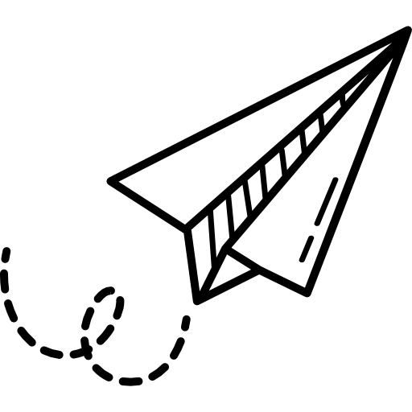

            

            
            

            
            <section class="page4">
                

                    <h1>Skills</h1>
                    

                    

                        <table class="tab">
                            <tr>
                                <td>Languages</td>
                                <td></td>
                            </tr>
                            <tr>
                                <td>Front-End Development</td>
                                <td></td>
                            </tr>
                            <tr>
                                <td>Photography</td>
                                <td></td>
                            </tr>
                            <tr>
                                <td>Photoshop</td>
                                <td></td>
                            </tr>
                            <tr>
                                <td>Drawing</td>
                                <td></td>
                            </tr>
                        </table>
                    

                

            </section>

            

            <section class="page5">
                

                

                    <h1>Work</h1>
                    

                        <h2>Photoshop</h2>
                        

                            

                                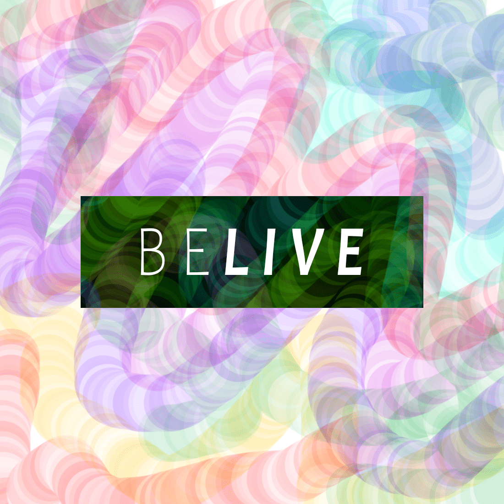
                            

                            

                                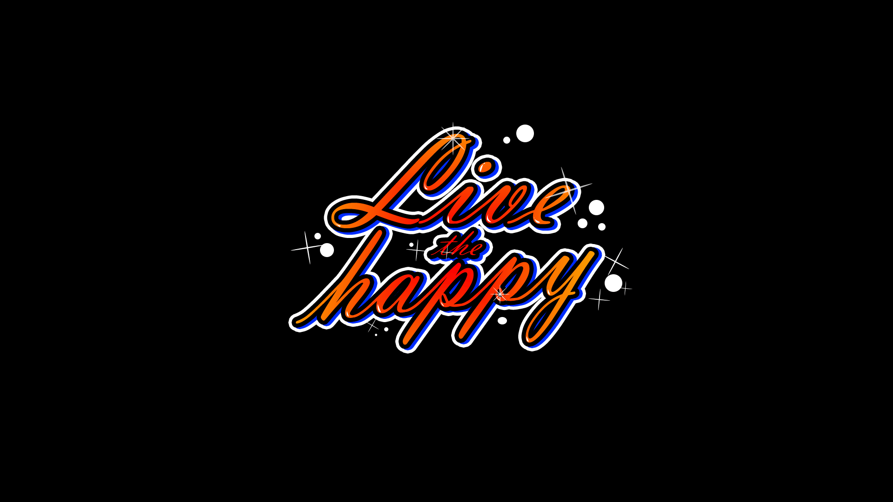
                            

                            

                                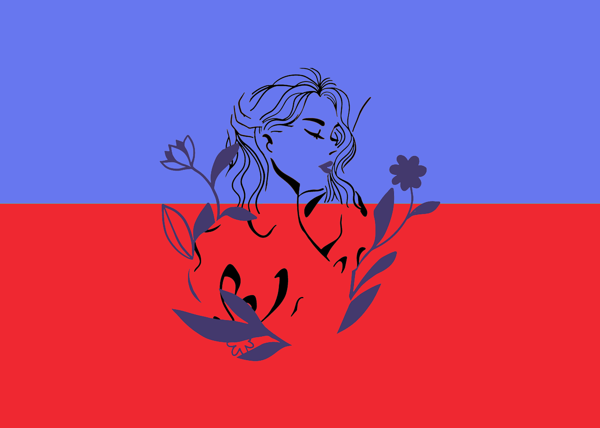
                            

                            

                                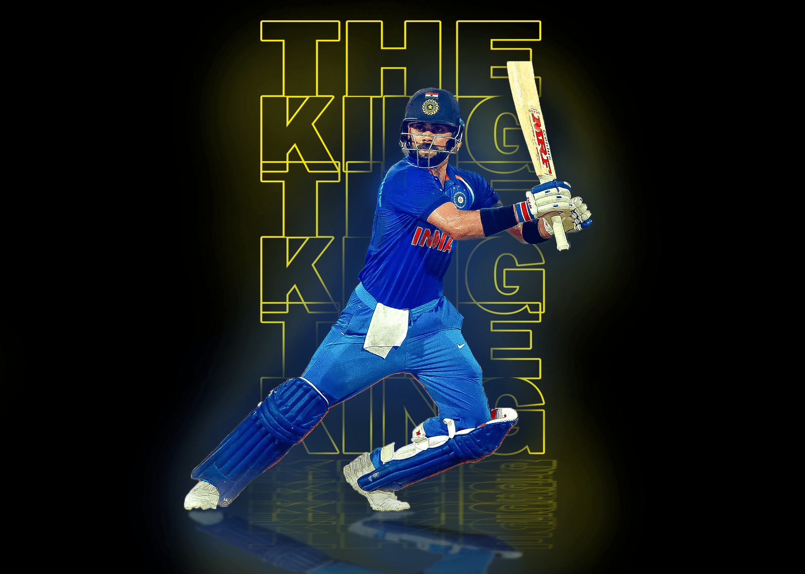
                            

                            

                                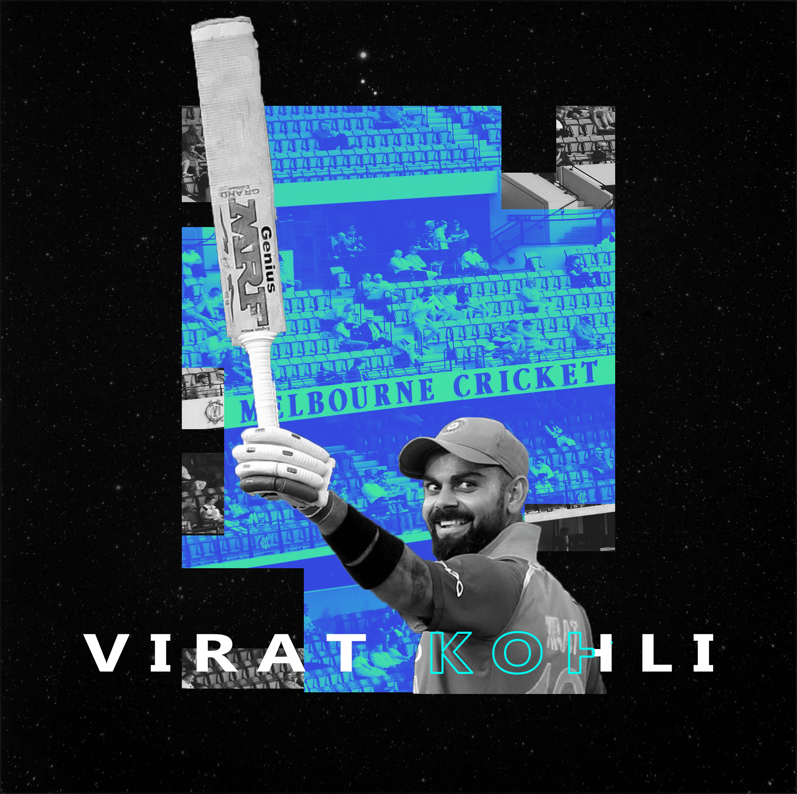
                            

                        

                    

                    

                        <h2>Photography</h2>
                        

                            

                                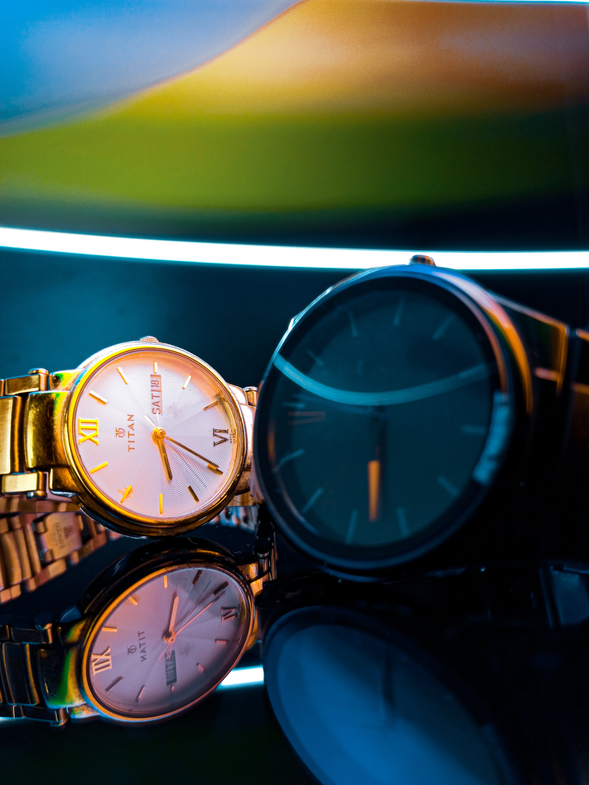
                            

                            

                                
                            

                            

                                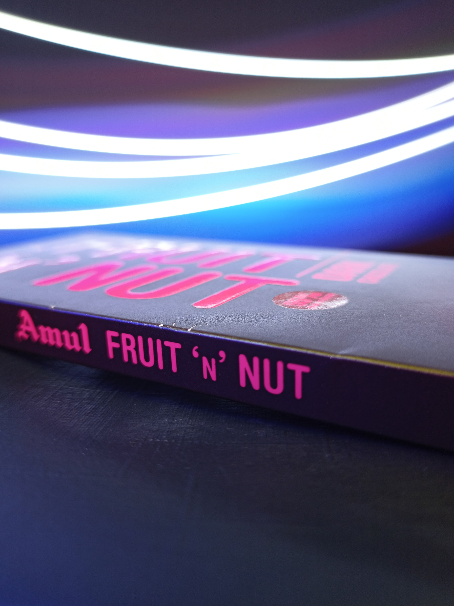
                            

                            

                                
                            

                            

                                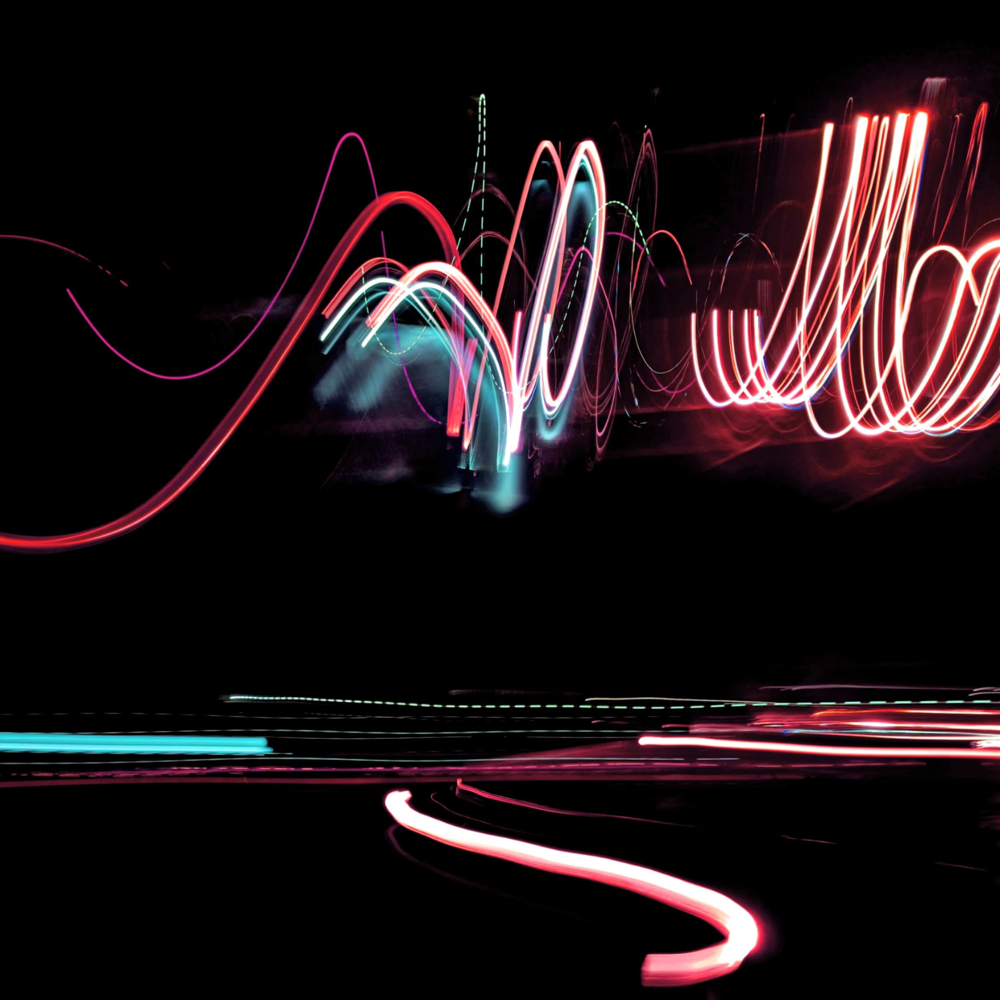
                            

                        

                    

                    

                        <h2>Front-End Project</h2>
                        

                            

                                <a href="https://codepen.io/SR_1008/pen/ZEePedQ?editors=1100">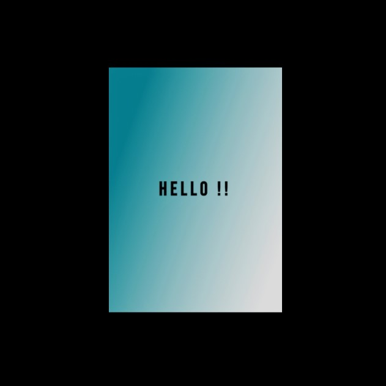</a>
                            

                            

                                <a href="https://codepen.io/SR_1008/full/BaLqBPd">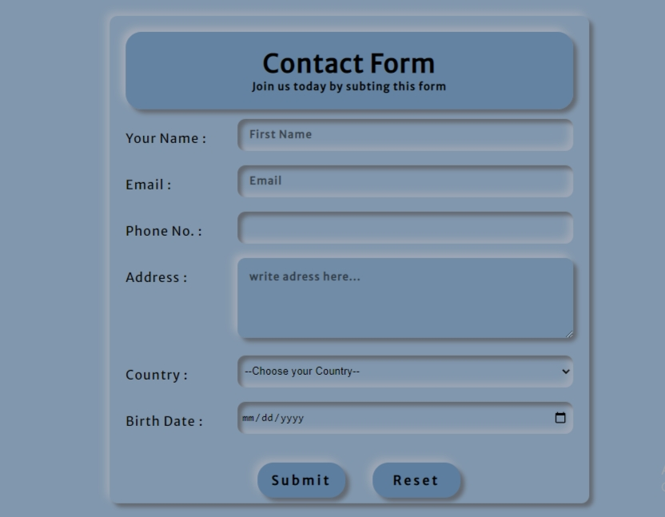</a>
                            

                            

                                
                            

                            

                                <h2>Many more has to come..</h2>
                            

                        

                    

                

            </section>

            

            

                <footer>
                    

                        <h2>Contact Me</h2>
                        
Here I share my Social-media links. So if you want to contact me than do so. Feel free to contact me & Feedbacks are welcome.

                        

                            <a href="https://www.linkedin.com/in/shivraj-chavda-28773b1a2"><i class="fa fa-linkedin" aria-hidden="true"></i></a>
                            <a href="https://www.facebook.com/shivraj.chavda.73/"><i class="fa fa-facebook" aria-hidden="true"></i></a>
                            <a href="https://www.instagram.com/SR_1008"><i class="fa fa-instagram" aria-hidden="true"></i></a>
                            <a href="https://codepen.io/sr_1008_/"><i class="fa fa-codepen" aria-hidden="true"></i></a>
                            

                                <a href="#"><i class="fa fa-envelope-o" aria-hidden="true"></i></a>
                                
shivrajchavda1008@gmail.com

                                

                            

                            

                                
made with <i class="fa fa-heart" aria-hidden="true"></i> by SR.

                            

                        

                    

                </footer>
            

        </main>
    

    
    

</body>
</html>
